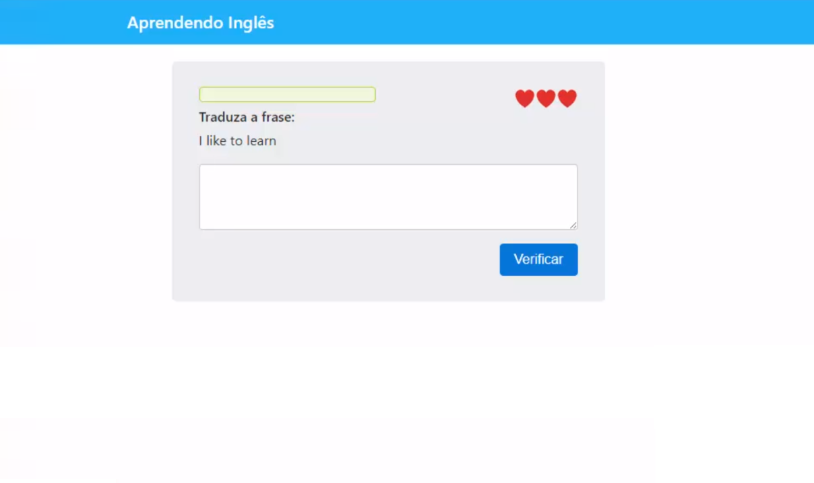

# Aprendendo Inglês
<h1 align="center">
    
</h1>


# Indice

- [Sobre](#-sobre)
- [Tecnologias utilizadas](#-tecnologias-utilizadas)
- [Como baixar o projeto](#-como-baixar-o-projeto)

## 🔖&nbsp; Sobre

O projeto **Apendendo Ingês** é uma landing page de tradução que foi criado dentro do curso [Introdução ao Angular, Jorge Sant Ana](https://www.udemy.com/course/curso-de-desenvolvimento-web-com-es6-typescript-e-angular-4/learn/lecture/6767396#questions) com o intuito de colocar em prática todo conteúdo estudado durante o curso

---

## 🚀 Tecnologias utilizadas

O projeto foi desenvolvido utilizando as seguintes tecnologias

- [HTML](https://developer.mozilla.org/pt-BR/docs/Web/HTML)
- [CSS](https://developer.mozilla.org/pt-BR/docs/Web/CSS)
- [JavaScript](https://developer.mozilla.org/pt-BR/docs/Web/JavaScript)
- [TypeScript](https://www.typescriptlang.org/)
- [Angular](https://angular.io/)

---

## 🗂 Como baixar o projeto

```bash
    # Clonar o repositório
    $ git clone https://github.com/KellyVasconcellos/aprendendo-ingles.git
    # Entrar no diretório
    $ cd aprendendo-ingles
```

---

Desenvolvido 💜 por Kelly Vasconcellos

